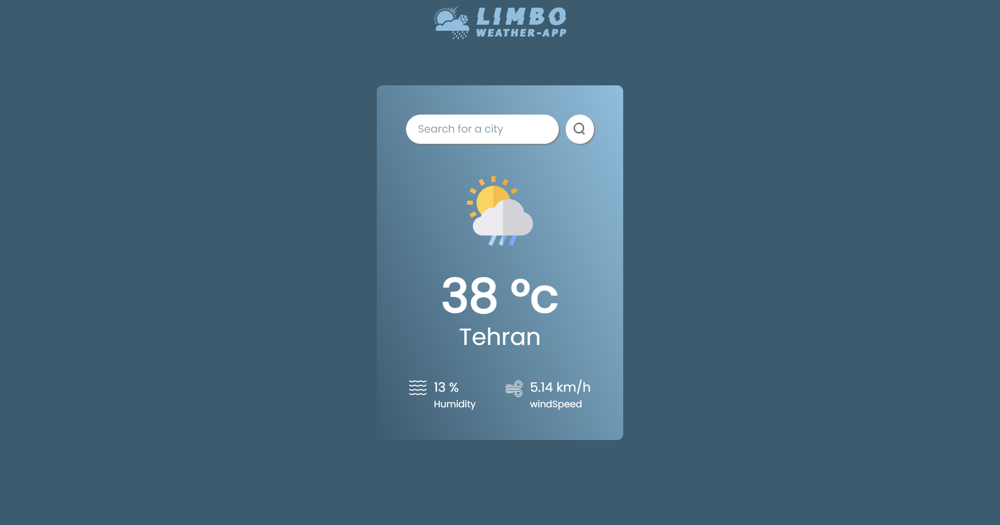

# 🌦️ Weather App

This is a weather application built with **React** that allows users to search for weather data by city name. The app fetches data from the OpenWeatherMap API and displays current weather conditions such as temperature, humidity, and wind speed.

## 🌐 Live Demo

You can view the live demo of the application here: [**Weather App**](https://p-limbo1996.github.io/Weather-App/)

## ✨ Features

- 🌍 **Real-time Weather Data:** Get up-to-date weather information for any city.
- 🌤️ **Dynamic Icons:** Weather icons change based on the current weather condition.
- 📱 **Responsive Design:** The application is fully responsive, working smoothly on both mobile and desktop devices.
- 💫 **Smooth Animations:** Animations powered by **AOS (Animate On Scroll)** for a delightful user experience.

## 🖼️ Screenshots



## 🛠️ Installation & Setup

To run this project locally, follow these steps:

1. **Clone the repository:**

    ```bash
    git clone https://github.com/p-limbo1996/Weather-App.git
    cd Weather-App
    ```

2. **Install dependencies:**

    Make sure you have [Node.js](https://nodejs.org/) installed, then run:

    ```bash
    npm install
    ```

3. **Add your OpenWeatherMap API Key:**

    - Create a `.env` file in the root of the project.
    - Add your OpenWeatherMap API key in the `.env` file like this:

    ```bash
    VITE_APP_ID=your_openweathermap_api_key
    ```

4. **Start the development server:**

    ```bash
    npm run dev
    ```

    The app will be available at `http://localhost:5173/`.

## 🚀 Usage

- Open the app.
- Enter a city name in the search bar and click the search icon 🔍.
- View the current weather details for the entered city.

## 🛠️ Technologies Used

- ⚛️ **React**: JavaScript library for building user interfaces.
- 🎨 **CSS**: For styling the components.
- 🌟 **AOS (Animate On Scroll)**: Library for adding animations on scroll.
- 💬 **SweetAlert2**: For beautiful alerts and prompts.
